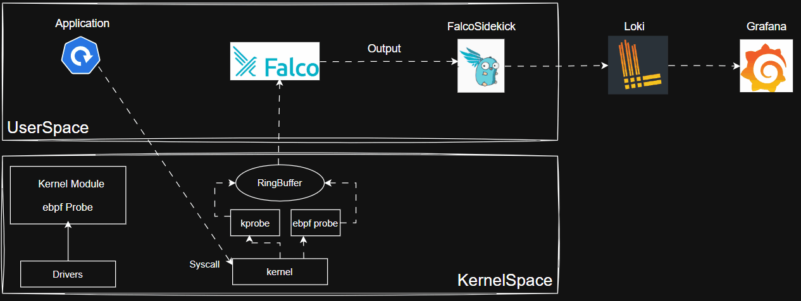
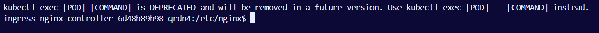
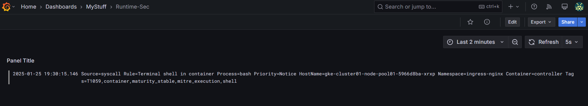

## k8s Runtime Security 
POC Repo for Implementing Runtime Security on Kubernetes Cluster.

### Environment Details:
- **K8s Cluster** : On Public Cloud GKE.
- **Runtime Security Tool** : CNCF Opensource Graduated Project Falco and FalcoSidekick. 
- **Visualization Tool for Security Events** : Grafana Platform.
- **Security Events Long Term Storage** : Grafana Loki.

> [!IMPORTANT]
> This repo doesn't cover the Infra/Configuration part. As It covers more the Architecture point of view.

### HLD:

Above diagram can be summarized as below:

- Falco when deployed on a k8’s cluster installs **epbf Probe Module/kernel Module**(depending on kernel version) in the kernel space.

- Any communications done by K8s application workload goes to the kernel and post installation of Falco the **epbf probe would capture syscalls**, thus tracking any kernel level activity.

- **Probed events are passed via Ring Buffer to User space** to Falco Rule engine that evaluates the Raw event against the Rules.

- **Events are then  matched with based on Rules Config** and sent as output to **FalcoSidekick**.

- The **Sidekick based on the routing configured passes the events to Long term events storage engine(Loki)**.

- To **Visualize the Received Events** and make Runtime Security Dashboards Opensource tool **Grafana** can be used.

### POC Results:

A **Notice** Severity Event Reported on Grafana Dashboard when user perform `exec` operation on container/pod.

**Note:** This is just an example severity event and any Critical/High Priority events can be displayed as well Similarly.

